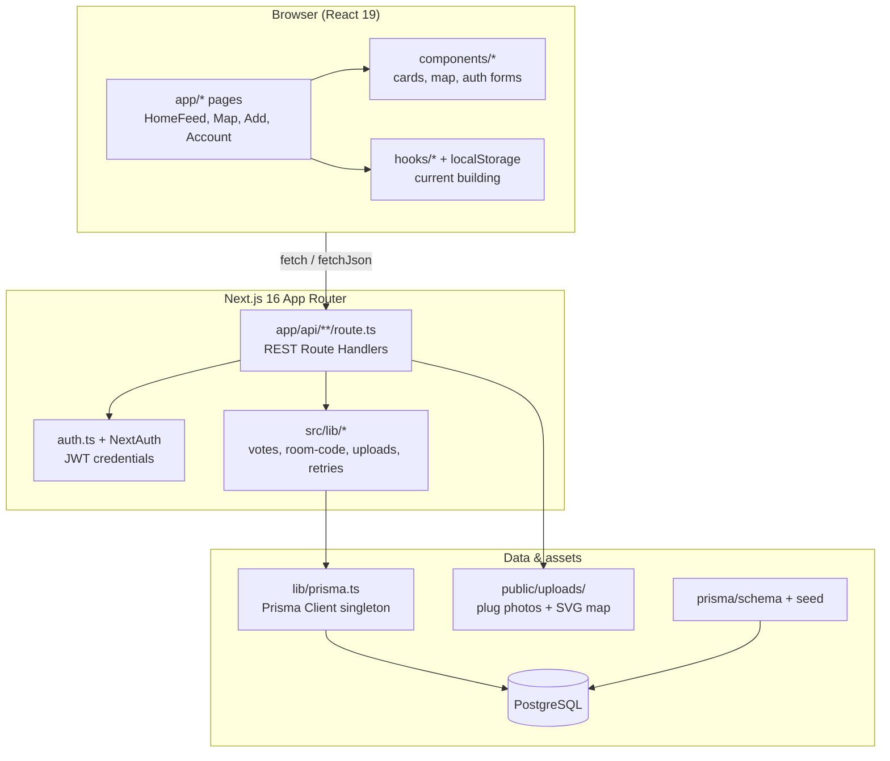
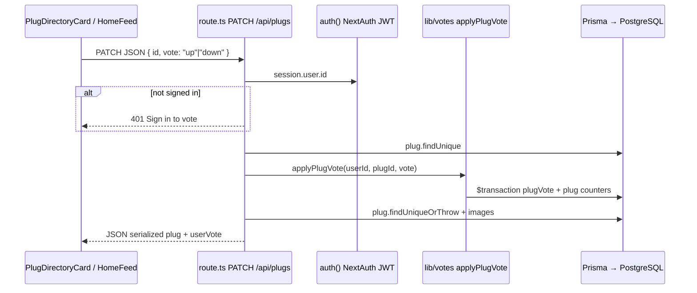

# SAIT Outlets

**Find a working outlet before your laptop dies — indoors, on campus, without GPS.**

## The Problem

If you have spent a full day at SAIT, you already know the pain: **battery anxiety is real**, and it gets worse the moment you step inside a building. Outdoor maps and turn-by-turn GPS assume open sky and street addresses. They do not understand **which wing of Seneca you are in**, whether **floor 4 of Heritage Hall** has a free outlet near your lab, or if the socket by the vending machine still works after someone tripped over the cord last week.

Traditional mapping stacks (Google Maps, PostGIS polygons, beacon triangulation) are built for roads and venues at city scale. On a dense polytechnic campus, they fail quietly: wrong floor, wrong building, stale POIs, and no signal that an outlet is **broken right now**. For students living between lectures, that is not a minor inconvenience — it is a daily, personal productivity tax.

## The Clever Solution: Crowdsourced Relational Feed

SAIT Outlets reframes indoor power discovery as a **relational, community-verified directory** instead of a navigation engine:

- **Building → floor → wing → micro-location** — Humans describe outlets the way students actually talk: *"Behind the vending machine near CA416"*, not lat/long indoors.
- **Crowdsourced plug points** — Anyone signed in can add a plug with photos; the feed grows with real campus knowledge.
- **Works / Broken votes** — Reliability is social proof, not a static map pin from 2019.
- **Room-code autofill** — SAIT-style codes (`CA416`, `NL1106`) jump straight to the right building and floor filters.
- **Schematic campus map** — A lightweight SVG map shows density by building without pretending we have indoor GPS.

We deliberately **did not** bolt on PostGIS or indoor positioning SDKs. Those tools optimize for geometric accuracy; we optimize for **speed, trust, and hackathon-grade reliability** on flaky campus Wi‑Fi — a Postgres + Prisma relational model, filterable feed, and local image storage.

## Tech Stack

| Layer | Choice | Why |
|--------|--------|-----|
| App | **Next.js** (App Router) | Server routes + mobile-first React UI |
| Styling | **Tailwind CSS** + **shadcn/ui** | Fast, consistent campus-native UI |
| Data | **PostgreSQL** + **Prisma** | Relational plug/building/vote model; no spatial complexity |
| Auth | **NextAuth** | Gated contributions and vote integrity |
| Assets | Local `public/uploads/` | Plug photos without external object storage |

## How to Run Locally

1. **Environment**

```bash
cp .env.example .env
```

Set `DATABASE_URL` in `.env` to your PostgreSQL connection string.

2. **Database**

```bash
npm run db:generate
npm run db:push
npm run db:seed
```

3. **Dev server**

```bash
npm run dev
```

Open [http://localhost:3000](http://localhost:3000).

## For hackathon judges (quick scan)

| Pass | Where to look |
|------|----------------|
| Problem / synthesis | This README — battery anxiety + indoor GPS failure |
| Architecture | [ARCHITECTURE.md](./ARCHITECTURE.md) |
| Clever code | `src/lib/room-code.ts`, `src/app/api/plugs/route.ts`, `src/lib/votes.ts` |
| Innovation | Crowdsourced relational feed + Works/Broken votes + SAIT room codes |
| UX | Mobile feed (`HomeFeed`), bottom filter sheet, `CampusMap` schematic map |
| Data model | `prisma/schema.prisma` (commented) |

**Demo tip:** Seed the DB, sign in, vote Works/Broken on a plug, try room code `CA416` in filters, open Map and set your building.

## What You Can Do in the App

- **Feed** (`/`) — Filter by building, floor, wing; "Near me" uses your saved building + map proximity
- **Campus map** (`/map`) — Schematic main-campus map with plug counts per building
- **Add plug** (`/add`) — Photos, room-code hints, micro-location description
- **Leaderboard** — Points for contributions and reliability votes
- **Account** — Your submissions, votes, and avatar

## Architecture

See **[ARCHITECTURE.md](./ARCHITECTURE.md)** for design decisions (relational indoor model vs PostGIS, vote denormalization, room-code parsing, schematic map + "near me" without GPS).

The app is a **Next.js full-stack monolith** with a **layered / BFF-style** layout: React pages and components call **Route Handlers** (`src/app/api/**/route.ts`), which delegate domain logic to **`src/lib/*`** and persistence to **Prisma → PostgreSQL**. It is not MVC (no separate controller layer), Hexagonal (no ports/adapters), or tRPC — thin HTTP handlers plus shared library modules.

### System overview (Mermaid)



### Example request: vote Works/Broken (`PATCH /api/plugs`)



### Folder map (high level)

```
sait-outlets/
├── prisma/
│   ├── schema.prisma      # User, Building, Plug, PlugVote, PlugImage
│   └── seed.ts            # Campus catalog + sample plugs
├── public/
│   ├── maps/              # Official SAIT campus SVG
│   └── uploads/plugs/     # Contributed plug photos
└── src/
    ├── app/               # App Router: pages + API Route Handlers
    │   ├── page.tsx       # / → HomeFeed
    │   ├── HomeFeed.tsx   # Main plug feed + filters
    │   ├── map|add|account|leaderboard|welcome/
    │   └── api/           # REST endpoints (plugs, buildings, upload, auth, account)
    ├── components/        # UI: cards, map, shell, nav, shadcn/ui, auth forms
    ├── hooks/             # Client hooks (e.g. saved building)
    ├── lib/               # Domain + infra: votes, prisma, room-code, uploads
    ├── data/              # Static campus metadata (floors/wings per code)
    └── auth.ts            # NextAuth config (credentials → Prisma User)
```

## Project Structure (key files)

- `prisma/schema.prisma` — `Building`, `Plug`, `PlugImage`, `PlugVote`, `User`
- `prisma/seed.ts` — SAIT building catalog + sample plugs
- `src/data/campus-buildings.ts` — Floor/wing metadata per building code
- `src/app/api/plugs/route.ts` — Feed query, create plug, vote PATCH
- `src/app/api/buildings/route.ts` — Building catalog for filters and map
- `src/app/api/upload/route.ts` — Multi-photo upload for plug evidence
- `src/app/api/parse-room/route.ts` — Room-code → building/floor/wing parser
- `src/components/PlugDirectoryCard.tsx` — Feed card, lightbox, Works/Broken voting
- `src/components/CampusMap.tsx` — Interactive SVG campus map
